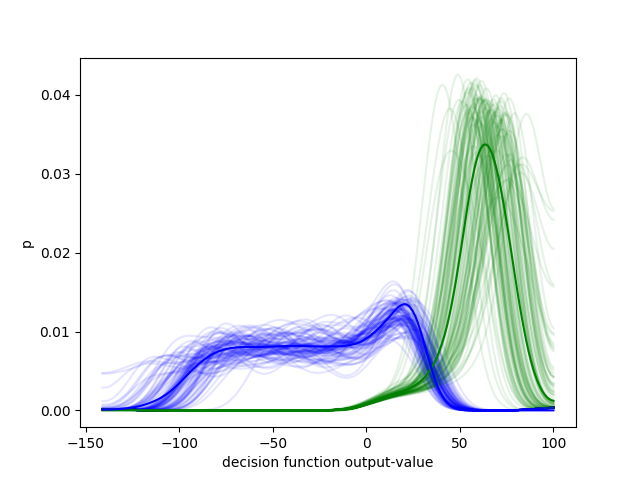
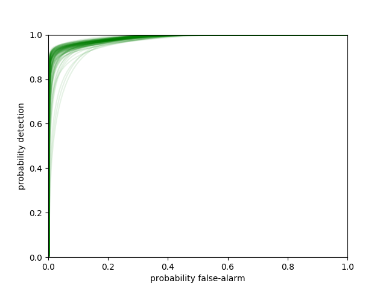
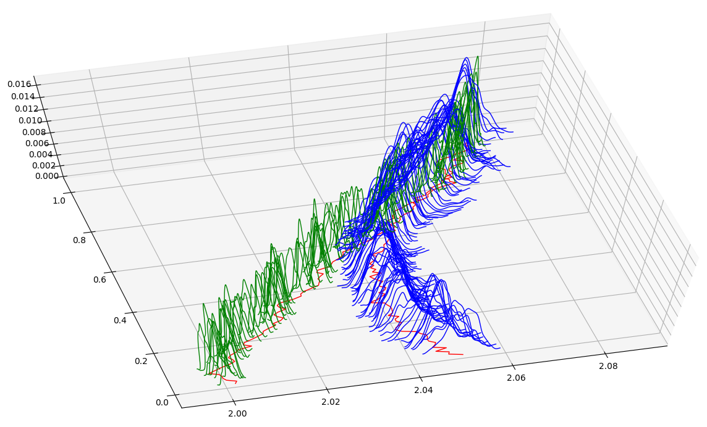
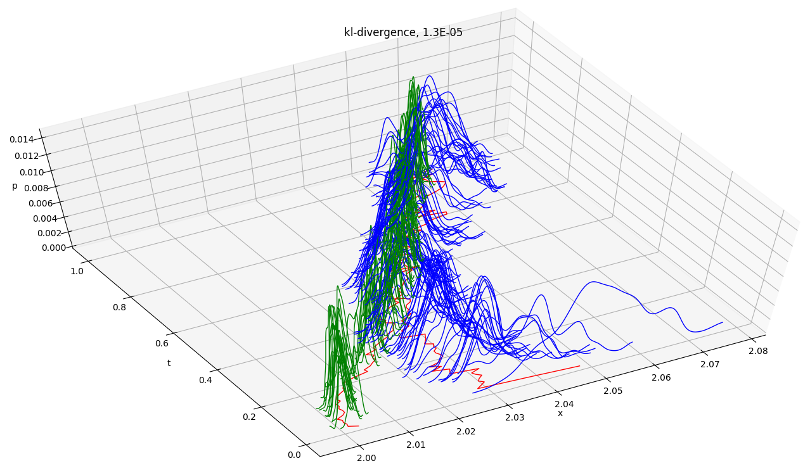
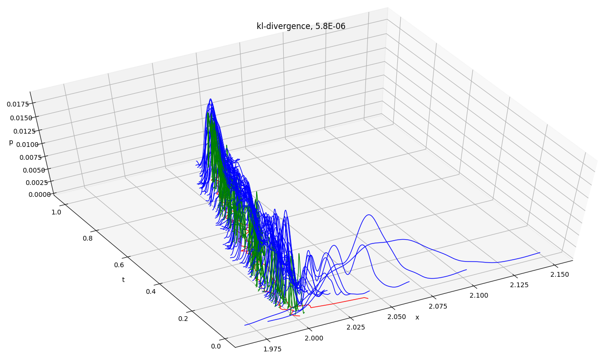

190418

brief [lit-review](https://www.linkedin.com/pulse/google-state-space-noah-smith/) posted on linkedin. 

190414

presentation [statespace.dev](https://statespace.dev/) has gone live.

190331

concise [motivation piece](https://www.linkedin.com/pulse/shape-uncertainty-noah-smith/) posted on linkedin.

190325

(structural time series = state space) [stuff from google](https://medium.com/tensorflow/structural-time-series-modeling-in-tensorflow-probability-344edac24083). going through the first [ref](papers/2015%20broderson.pdf) - basic skeleton for bringing aerospace stuff into a picture bizpeople understand and want... good step on the path towards a solutions company.

190310

decision-function-based detector is go. simplest possible case - linear rc-circuit system-model and linear kalman-filter tracker. log-likelihood decision function for detection, ensembles of 100 runs each for signal case and noise case. output curves shown in the first plot - green signal, blue noise-only. roc curves in the second plot. 

 

<a name="190223"/>190223

kl-divergence for evaluating sequential monte-carlo - demonstrated below by three pf's in action during the first second of the jazwinksi problem - start-up and convergence. these are 100 hz dist-curves - each dist-curve is a kernel-density-estimate combining hundreds of monte-carlo samples, the fundamental-particles - green dist-curves for truth, blue dist-curves for pf. state-estimates are two red curves on the x,t-plane beneath the dist-curves.

190215

cloud stuff

    gcloud auth login
    gcloud projects list
    source cloud.env
    gcloud config set project statespace-233406
    gcloud beta container --project $PROJECT clusters create $CLUSTER --zone $ZONE
    kubectl create -f services.yaml
    kubectl create -f ingress.yaml && kubectl create -f deployments.yaml && kubectl create -f secrets.yaml

190105

ukf adaptive jazwinksi switched to square-root filtering, qr-factorization, cholesky-factor update and downdate. improved numerical stability and scaled sampling is clear. still a question around scalar-obs and the obs cholesky-factor and gain. with an adhoc stabilizer on the obs cholesky-factor it's working well overall.

181230

pf adaptive jazwinksi. parameter-roughening.

181226

ukf adaptive jazwinski. sample-and-propagate tuning.

180910

ekf adaptive jazwinski. ud-factorized square-root filtering required for numerical stability.
