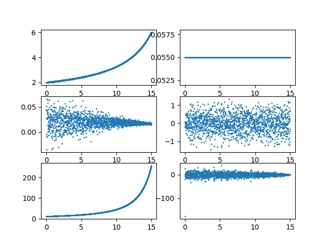

uncertainty, confidence, knowledge

their evolution with time and various processes, including noise and observations

risk and the cost of errors

181216

testing gitlab

180910

demonstration of covariance numerical instability using just the jazwinski tracking problem with two additional states for model-parameter estimation - first plot is direct ekf, second plot is ud factorized ekf

 

[The Flaw of Averages: Why We Underestimate Risk in the Face of Uncertainty, Sam L. Savage](http://a.co/cDDBO9p)

[Bayesian Signal Processing: Classical, Modern, and Particle Filtering Methods, James V. Candy](http://a.co/gp4upXd)

[Capital Ideas: The Improbable Origins of Modern Wall Street, Peter L. Bernstein](http://a.co/1Y1DR9p)

[Stochastic Processes and Filtering Theory, Andrew H. Jazwinski](http://a.co/cm5zfQu) 

[A Demon of Our Own Design: Markets, Hedge Funds, and the Perils of Financial Innovation, Richard Bookstaber](http://a.co/4FvnyfB)

[Kalman Filtering: Theory and Practice, Mohinder S. Grewal, Angus P. Andrews](http://a.co/6hAa35c)

