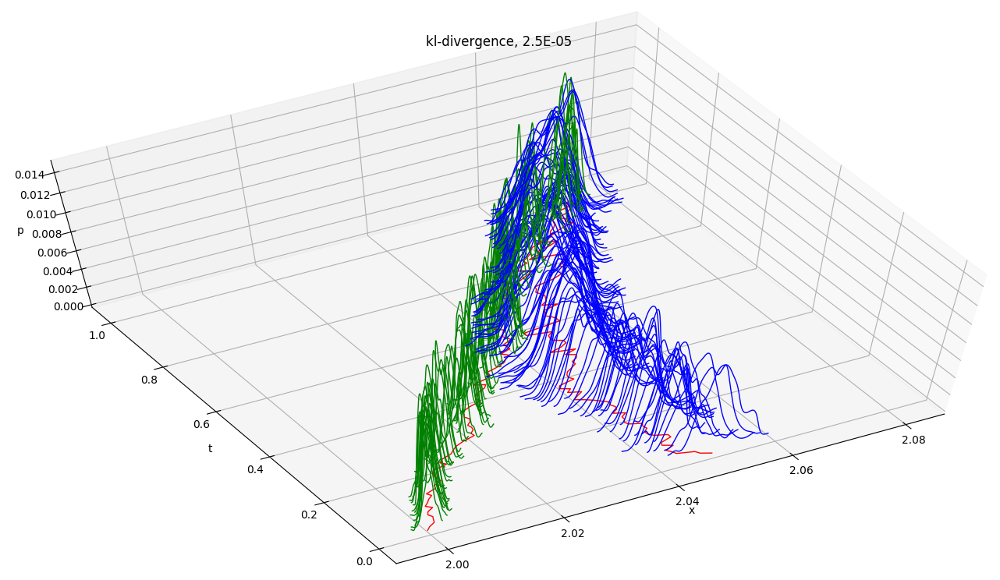

190223

190208

running in a docker container

190105

spkf adaptive jazwinksi switched to square-root filtering, qr-factorizaion, cholesky-factor update and downdate. improved numerical stability and scaled sampling is pretty clearly working correctly. still a question around scalar-obs and the obs cholesky-factor and gain. with an adhoc stabilizer on the obs cholesky-factor, it's working well overall.

181230

particle adaptive jazwinksi. focus is parameter-roughening.

181226

spkf adaptive jazwinski. focus is tuning the sampling part of sample-and-propagate.

181225

auto build-test-deploy

180910

ekf adaptive jazwinski. ud-factorization required for numerical stability.
