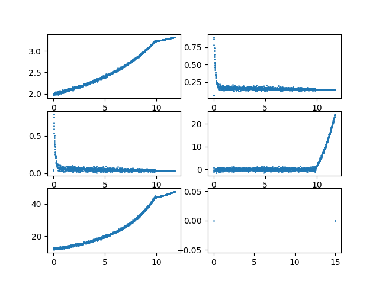
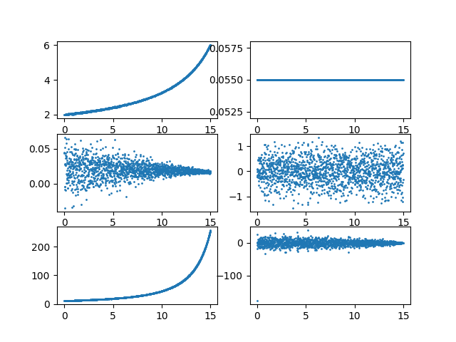

uncertainty, confidence, knowledge

their evolution with time and various processes, including noise and observations

risk and the cost of errors

[references](http://statespace.icu/docs/references), [help](https://github.com/noahhsmith/statespace/tree/master/statespace)

180910

demonstration of numerical instability in covariance matrices using just the jazwinski tracking problem with two additional states for model-parameter estimation

direct ekf

 

ud factorized ekf 

